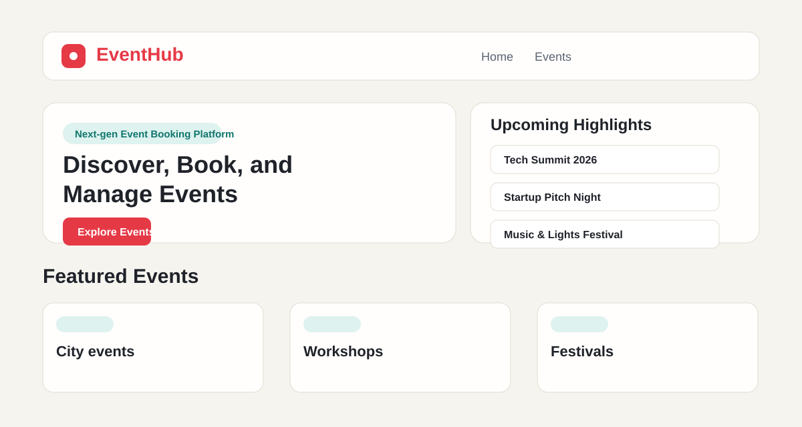
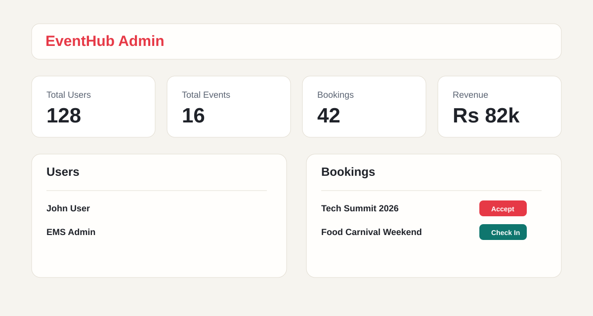

# Event Management System (EMS)

A full-stack Event Management System built with React, Spring Boot, JWT security, and MySQL. Users can browse events, save favorites, book tickets, and track booking status. Admins can manage events, approve bookings, check in attendees, and view analytics.



## Live Links

| Resource | URL |
| --- | --- |
| Live Frontend | [ems.com](https://frontend-seven-topaz-40.vercel.app) |
| Frontend Deployment | https://frontend-ad161qsy9-prateek-gokhales-projects.vercel.app |
| Backend API | https://ems-backend-production-700f.up.railway.app |
| Events API | https://ems-backend-production-700f.up.railway.app/api/events |
| GitHub Repository | https://github.com/Prateek-Gokhale/Event-Management-System-EMS- |
| Railway Project | https://railway.com/project/f68a3f6c-f98f-467a-9cdc-8b60fd73449a |

## Tech Stack

| Layer | Technology |
| --- | --- |
| Frontend | React, React Router, Axios, React Toastify, Vite, CSS |
| Backend | Spring Boot, Spring Security, JWT, Spring Data JPA |
| Database | MySQL |
| Build Tools | Maven, npm |

## Features

### User

- Register and login with JWT authentication.
- Browse all events with dropdown filters for event name, category, city, date range, and price range.
- View event details with venue, city, organizer information, seats, map link, ratings, and reviews.
- Save events to favorites.
- Add events to cart and confirm bookings.
- Apply mock coupons such as `WELCOME10` and `STUDENT20`.
- View booking status, ticket code, and QR payload from the dashboard.
- Add event reviews and ratings.

### Admin

- Admin dashboard with users, bookings, revenue, and popular categories.
- Add, update, and delete events.
- Upload event image through a file picker or provide an image URL.
- Manage event capacity, city, venue, address, organizer details, and price.
- Accept pending bookings.
- Check in accepted bookings.
- View booking analytics and total revenue.



## Seeded Events

The backend auto-seeds 16 sample events across different cities, including Bengaluru, Mumbai, Goa, Jaipur, Delhi, Pune, Hyderabad, Chennai, Kolkata, Ahmedabad, Lucknow, Noida, Bhopal, Chandigarh, Kochi, and Indore.

## Folder Structure

```text
event-management-system/
├── backend/
│   ├── pom.xml
│   └── src/
│       ├── main/java/com/ems/
│       │   ├── config/
│       │   ├── controller/
│       │   ├── dto/
│       │   ├── entity/
│       │   ├── exception/
│       │   ├── repository/
│       │   ├── security/
│       │   ├── service/
│       │   └── EmsApplication.java
│       └── main/resources/application.properties
├── frontend/
│   ├── package.json
│   ├── index.html
│   └── src/
│       ├── api/
│       ├── components/
│       ├── context/
│       ├── pages/
│       ├── routes/
│       ├── styles/
│       └── utils/
├── database/
│   ├── ems_schema.sql
│   └── sample_data.sql
├── docs/images/
└── README.md
```

## API Overview

### Auth

- `POST /api/auth/register`
- `POST /api/auth/login`

### Events

- `GET /api/events`
- `GET /api/events/{id}`
- `POST /api/events` - Admin/Organizer
- `PUT /api/events/{id}` - Admin/Organizer
- `DELETE /api/events/{id}` - Admin/Organizer
- `GET /api/events/{eventId}/reviews`
- `POST /api/events/{eventId}/reviews`

### Favorites

- `GET /api/favorites`
- `POST /api/favorites/{eventId}`
- `DELETE /api/favorites/{eventId}`

### Bookings

- `POST /api/bookings`
- `GET /api/bookings/my`
- `GET /api/bookings/user/{userId}`

### Admin

- `GET /api/admin/users`
- `GET /api/admin/bookings`
- `GET /api/admin/analytics`
- `PUT /api/admin/bookings/{bookingId}/status`
- `PUT /api/admin/bookings/{bookingId}/check-in`

## Local Setup

### 1. MySQL

Create a MySQL database:

```sql
CREATE DATABASE ems_db;
```

You can either run `database/ems_schema.sql` manually or let Spring Boot update the schema automatically with `spring.jpa.hibernate.ddl-auto=update`.

### 2. Backend

```bash
cd backend
mvn spring-boot:run
```

Default backend URL:

```text
http://localhost:8081
```

### 3. Frontend

```bash
cd frontend
npm install
npm run dev
```

Default frontend URL:

```text
http://localhost:5173
```

## Environment Variables

### Backend

The backend supports environment-based deployment configuration:

```env
PORT=8081
DATABASE_URL=jdbc:mysql://localhost:3306/ems_db?useSSL=false&allowPublicKeyRetrieval=true&serverTimezone=UTC
DATABASE_USERNAME=root
DATABASE_PASSWORD=root123
JWT_SECRET=replace-with-a-long-random-secret
JWT_EXPIRATION_MS=86400000
CORS_ALLOWED_ORIGINS=http://localhost:5173,http://localhost:3000
```

### Frontend

Create `frontend/.env` when needed:

```env
VITE_API_BASE_URL=http://localhost:8081/api
```

## Sample Credentials

Auto-seeded accounts:

| Role | Email | Password |
| --- | --- | --- |
| Admin | `admin@ems.com` | `Admin@123` |
| User | `user@ems.com` | `User@123` |

If you use `database/sample_data.sql`, both sample passwords may be `password`.

## Build and Test

Backend:

```bash
cd backend
mvn test
```

Frontend:

```bash
cd frontend
npm run build
```

## Deployment Notes

Current deployment split:

- Frontend: Vercel
- Backend: Railway
- Database: Railway MySQL

Set `VITE_API_BASE_URL` in the frontend host to your backend API URL, and set `CORS_ALLOWED_ORIGINS` in the backend host to your frontend domain.

## License

This project is intended for academic and portfolio use.
